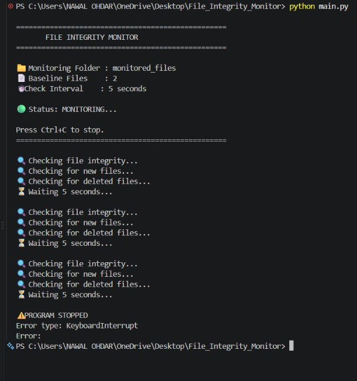

# File Integrity Monitor (FIM)

A Python-based File Integrity Monitoring system that uses SHA-256 hashing to detect unauthorized or unexpected changes in monitored files.

## 📌 Project Overview

The File Integrity Monitor (FIM) is a cybersecurity tool developed in Python.

It continuously monitors important files and compares their current SHA-256 hash values with the original values stored in a baseline.

The system can detect:

- Modified files
- New files
- Deleted files

Whenever a security-related change is detected, the system generates an alert and records the event in the log file.

## 🎯 Project Objectives

The main objectives of this project are:

1. Monitor important files continuously.
2. Generate SHA-256 hashes for files.
3. Create a baseline of trusted files.
4. Detect unauthorized file modifications.
5. Detect newly created files.
6. Detect deleted files.
7. Prevent repeated duplicate alerts.
8. Record security events in a log file.
9. Provide continuous monitoring at regular intervals.
10. Demonstrate a basic cybersecurity monitoring system.

## 🚀 Features

- SHA-256 file hashing
- Baseline creation
- File modification detection
- New file detection
- Deleted file detection
- Duplicate alert prevention
- Security event logging
- Continuous file monitoring
- 5-second monitoring interval
- Terminal monitoring dashboard
- Safe shutdown using Ctrl+C
- JSON-based baseline storage
- JSON-based alert state storage

## 🛠️ Technologies Used

- Python 3
- SHA-256
- JSON
- OS File System
- Python Logging
- VS Code
- Windows 11

## 📂 Project Structure

```text
File_Integrity_Monitor/
│
├── alert_state.json
├── baseline.json
├── baseline_backup.json
├── fim.log
├── hash_utils.py
├── logger.py
├── main.py
├── monitor.py
├── requirements.txt
├── README.md
│
└── monitored_files/
    ├── important.txt
    └── newfile.txt

📄 Description of Important Files
main.py

The main program file.

It starts the File Integrity Monitor, displays the monitoring dashboard, and continuously checks the monitored folder.

monitor.py

Contains the main monitoring functions.

It checks for:

Modified files
New files
Deleted files

It also handles duplicate alert prevention.

hash_utils.py

Contains the function used to calculate the SHA-256 hash of a file.

logger.py

Handles security event logging.

Detected events are recorded in fim.log.

baseline.json

Stores the original SHA-256 hash values of monitored files.

The baseline is used as the trusted reference for integrity checking.

alert_state.json

Stores previously reported alerts to prevent the same alert from being displayed repeatedly during every monitoring cycle.

fim.log

Stores security events detected by the File Integrity Monitor.

monitored_files

This folder contains the files that are being monitored.

⚙️ How the File Integrity Monitor Works

The basic working process is:

                START
                  │
                  ↓
        Load Baseline File
                  │
                  ↓
       Scan Monitored Folder
                  │
                  ↓
       Calculate SHA-256 Hash
                  │
                  ↓
       Compare With Baseline
                  │
          ┌───────┼────────┐
          ↓       ↓        ↓
      Modified   New     Deleted
          │       │        │
          ↓       ↓        ↓
        Alert   Alert    Alert
          │       │        │
          └───────┼────────┘
                  ↓
          Write Event to Log
                  │
                  ↓
          Wait 5 Seconds
                  │
                  ↓
          Repeat Monitoring
🔐 SHA-256 Hashing

SHA-256 is a cryptographic hashing algorithm.

A file is converted into a unique-looking fixed-length hash value.

For example:

Original File
     ↓
SHA-256 Algorithm
     ↓
3722156465e6962e7f2fbe268ce59cf4173bc51ec577936dea4e750d9297e0e7

If the file content changes, its SHA-256 hash also changes.

The FIM uses this property to identify file modifications.

📋 Baseline

The baseline represents the trusted original state of the monitored files.

Example:

{
    "monitored_files/important.txt": "SHA-256-HASH",
    "monitored_files/newfile.txt": "SHA-256-HASH"
}

During monitoring, the current file hash is compared with the baseline hash.

If both hashes are different, the file is considered modified.

🚨 File Modification Detection

When a monitored file is modified, the system displays an alert.

Example:

--------------------------------------------
🚨 ALERT: File has been modified!
File: monitored_files/important.txt
Original Hash: ORIGINAL_HASH
Current Hash: CURRENT_HASH

The event is also recorded in fim.log.

🆕 New File Detection

If a new file is created inside the monitored folder and it is not present in the baseline, the system detects it.

Example:

--------------------------------------------
🚨 ALERT: New file detected!
File: monitored_files/final_security_test.txt
🗑️ Deleted File Detection

If a file stored in the baseline is deleted from the monitored folder, the system detects the deletion.

Example:

--------------------------------------------
🚨 ALERT: File has been deleted!
File: monitored_files/important.txt
🔄 Duplicate Alert Prevention

The system uses alert_state.json to remember previously reported alerts.

This prevents the same alert from appearing repeatedly during every 5-second monitoring cycle.

For example, after detecting a modification:

🚨 ALERT: File has been modified!

the same alert will not be repeatedly displayed until the relevant state changes.

📝 Logging

Security events are stored in:

fim.log

Example:

[2026-09-12 11:43:34] ALERT: File modified: monitored_files/important.txt

The log provides a history of detected integrity events.

▶️ How to Run the Project
Step 1: Open the Project

Open the project folder in VS Code.

Step 2: Open Terminal

Open the VS Code terminal.

Step 3: Run the Program

Use:

python main.py
Step 4: Monitor the Output

The program displays:

==================================================
       FILE INTEGRITY MONITOR
==================================================

📁 Monitoring Folder : monitored_files
📄 Baseline Files    : 2
⏱️ Check Interval    : 5 seconds

🟢 Status: MONITORING...

The system checks the monitored folder every 5 seconds.

Step 5: Stop the Program

Press:

Ctrl + C

The program safely handles the KeyboardInterrupt and stops monitoring.

🧪 Testing Performed

The project has been tested for the following conditions:

1. Modification Test

A monitored file was modified and the system successfully generated a modification alert.

2. New File Test

A new file was created inside the monitored folder and the system successfully detected it.

3. Deleted File Test

A baseline file was deleted and the system successfully detected the deletion.

4. Duplicate Alert Test

The same security event was monitored over multiple cycles and duplicate alerts were prevented.

5. Logging Test

Detected security events were successfully written to fim.log.

6. Continuous Monitoring Test

The system continuously checked the monitored folder at 5-second intervals.

7. Safe Shutdown Test

The program was stopped using Ctrl+C and handled KeyboardInterrupt safely.

📊 Example Monitoring Output
==================================================
       FILE INTEGRITY MONITOR
==================================================

📁 Monitoring Folder : monitored_files
📄 Baseline Files    : 2
⏱️ Check Interval    : 5 seconds

🟢 Status: MONITORING...

🔍 Checking file integrity...
🔍 Checking for new files...
🔍 Checking for deleted files...
⏳ Waiting 5 seconds...
🚨 Example Security Alert
--------------------------------------------
🚨 ALERT: File has been modified!
File: monitored_files/important.txt
Original Hash: ORIGINAL_HASH
Current Hash: CURRENT_HASH

🔒 Security Importance

File Integrity Monitoring is an important concept in cybersecurity.

It can help identify unexpected changes to important files.

FIM can be useful in:

Cybersecurity monitoring
SOC environments
Incident detection
System administration
Server monitoring
Security auditing
Compliance monitoring

🏢 Possible Real-World Use

A more advanced version of this project could be used to monitor:

System configuration files
Application files
Server files
Important documents
Security-related files
Critical system directories

In a professional environment, FIM can be integrated with security monitoring and SIEM solutions.

🔮 Future Improvements

The project can be improved by adding:

Email alerts
Telegram alerts
Desktop notifications
Real-time monitoring using watchdog
SQLite database
Web dashboard
User authentication
Alert severity levels
SIEM integration
Automatic baseline updates
Multiple monitored directories
Windows Event Log integration
Advanced reporting
Threat intelligence integration

📚 Learning Outcomes

Through this project, the following concepts were practiced:

Python programming
File handling
Directory scanning
SHA-256 hashing
JSON data handling
Logging
Exception handling
Continuous monitoring
Security alert generation
File integrity concepts
Basic cybersecurity monitoring

📌 Limitations

This is a beginner-to-intermediate cybersecurity project.

The current version:

Uses a local JSON baseline.
Uses a local log file.
Runs from the command line.
Checks files every 5 seconds.
Does not automatically determine whether a change is malicious.
Does not provide a graphical dashboard.
Does not send remote notifications.

These features can be added in future versions.

👨‍💻 Author

Nawal Ohdar

B.Tech Computer Science and Engineering
Specialization: Cybersecurity

📄 License

This project is created for educational and cybersecurity learning purposes.

⭐ File Integrity Monitor

A simple Python cybersecurity project for detecting file modifications, new files, and deleted files using SHA-256 hashing.

## Project Demo

### FIM Dashboard

